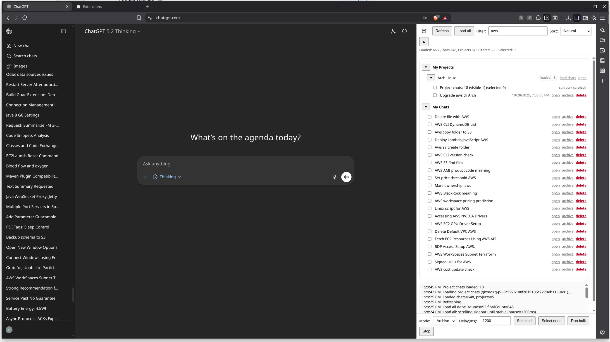
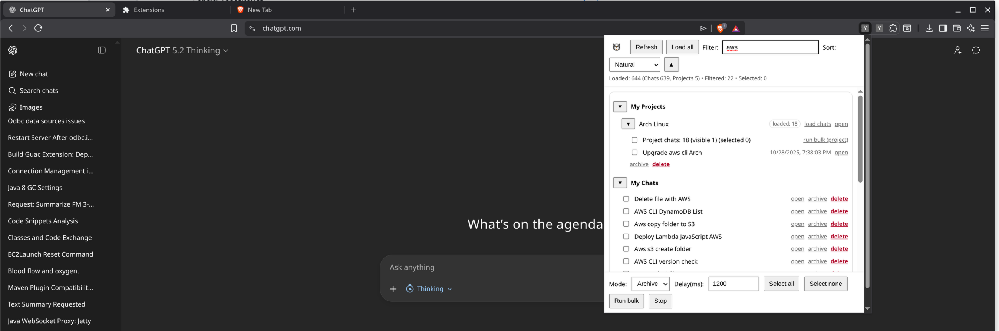

# ChatGPT Bulk Chat Manager (Chrome Extension)

I got tired of waiting for OpenAI to provide something half decent to manage GPT conversations, and this is how this repo was born.

This project is a **Chrome extension** for **chatgpt.com** that:
- **Scrapes the DOM** (sidebar) to list chats/projects, and
- Uses **authenticated backend requests** (via your existing session) to **archive** or **delete** conversations in bulk.

> ⚠️ **Fragile by nature:** ChatGPT’s UI and internal endpoints can change at any time. When the page structure or APIs change, this extension may stop working.

---

## Reality / Disclaimer (please read)

- I **did not hand-write this code**. I basically tortured GPT for a few hours until it produced something that works.
- I made **zero manual code changes** to the final output.
- To make it maintainable, I also had GPT generate a **rebuild prompt** so the extension should be:
  1. **Easy to regenerate** if it breaks due to UI/API changes
  2. Easy to **recreate independently** if you don’t trust this repo

### Trust model (important)
If you don’t trust this extension after reading the code (and you generally **should not trust any browser extension**):
- An extension can read everything on the page (including your chat list and content),
- It can scrape text, links, metadata, and potentially share links.

**Recommendation:**  
✅ Read the code.  
✅ Prefer running it as **unpacked** (developer mode).  
✅ If you’re uncomfortable, use the included **prompt** to generate your own version and compare diffs.

---

## Features

- **Side Panel UI** (persistent; doesn’t close when you click elsewhere) or **Poup UI** version
- **My Chats** list with:
  - local **filter** (“name contains…”)
  - **sort**: Natural (sidebar order) or Alphabetical, Asc/Desc
  - multi-select checkboxes + **bulk archive/delete**
- **My Projects** section:
  - list projects
  - load project conversations via backend API (paginated)
  - same bulk actions on project chats
  - Only handles visible in the sidebar Projects, I was too lazy to try to load all of them
- **Safety controls**
  - configurable delay between operations (rate-limit friendly)
  - **Stop** button (stops after current item; does not revert) - the intent was to be able to stop the bulk operation, but it gets grayed out
- **Local status marking**
  - archived items: crossed out + `undo`
  - deleted items: crossed out, no actions

---

## Screenshots

### Side Panel UI

### Side Panel UI

